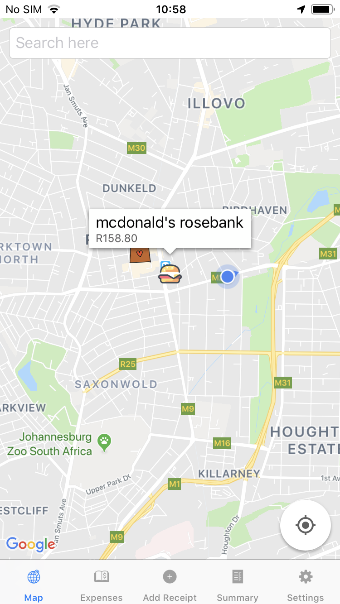
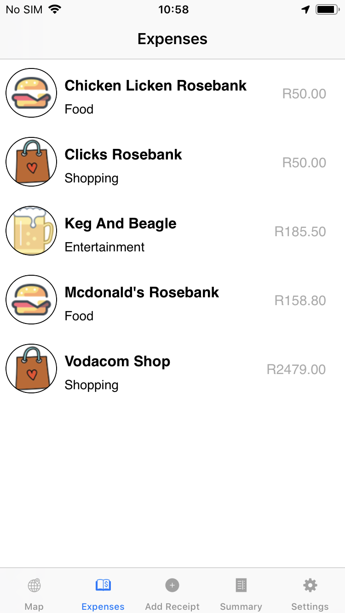
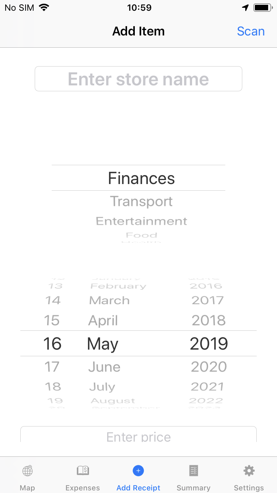
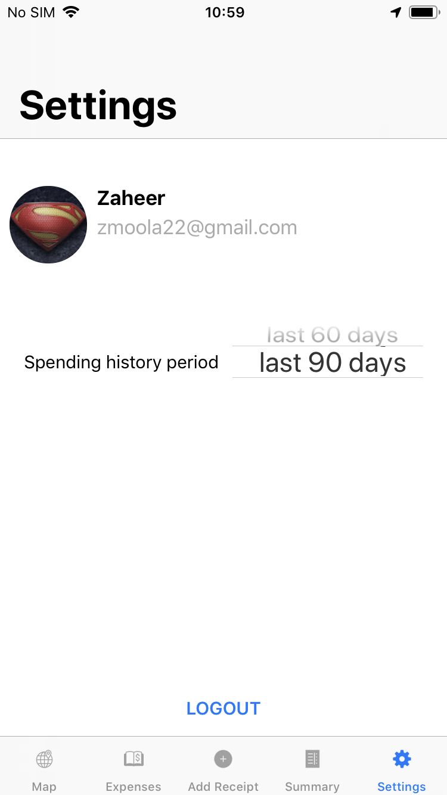

# GeoBudgeting-iOS

    

   

GeoBudgeting is an iOS app that allows a user to track expenses. A user scans receipts (or enters data manually) and the purchase information is then plotted on a map, allowing the user to see the total amount spent at that specific store. In addition, purcahses are also arranged into categories allowing the user to see how much is spent in each category.

## Key Features
* The user can add a purchase by manually adding data or by taking a picture of a receipt
* Purchase information is plotted on a map and includes store name, total spent, and category
* Users can view all purchases for a specific store
* Users can see a summary of total amount spent per category

## Using the GeoBudgeting app

### Add a purchse
* Open the app and select "Add Receipt" on the tab bar
* A purchase can be added using one of two methods: 
    * Enter purchase information manually
        * Fill in the fields
        * Tap "Add Item"
    * Take a picture of a receipt and the app automatically fills in purchase information 
        * Tap "Scan" (found in the top right hand corner of the screen)
        * The fields are automatically filled in
        * Tap "Add Item"

### See purchases on the map
* Select "Map" on the tab bar
* Purchases are displayed as icons on the map
* Each icon on the map relates to a store where a purchase was made
* Tap the icon to see additional information relating to the purchase

### See a list of stores where purchases were made
* Select "Expenses" on the tab bar
* The app displays a list of stores along with the category and total amount spent at the store
* Tap on one of the items in the list to see a detailed view of purchases made at that specific store

### See total amount spent per category
* Select "Summary" on the tab bar 
* Categorized purchases are displayed

### Log out and change app settings
* Select "Settings" on the tab bar
* To log out, tap "logout"
* Change the spending history to see purchases for the last 30, 60, or 90 days

## Credits

This app was built using the following

* Google Firebase
* OCRWebService

## Authors
* Divine Dube
* Marie Harmsen
* Prateek Kambadkone
* David Minders
* Zaheer Moola